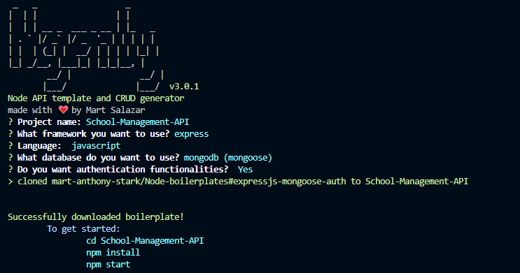
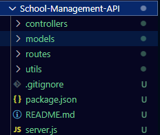
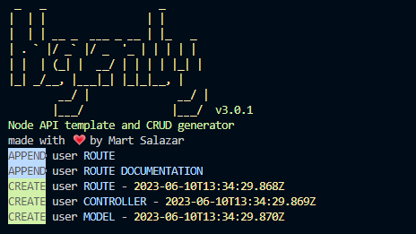
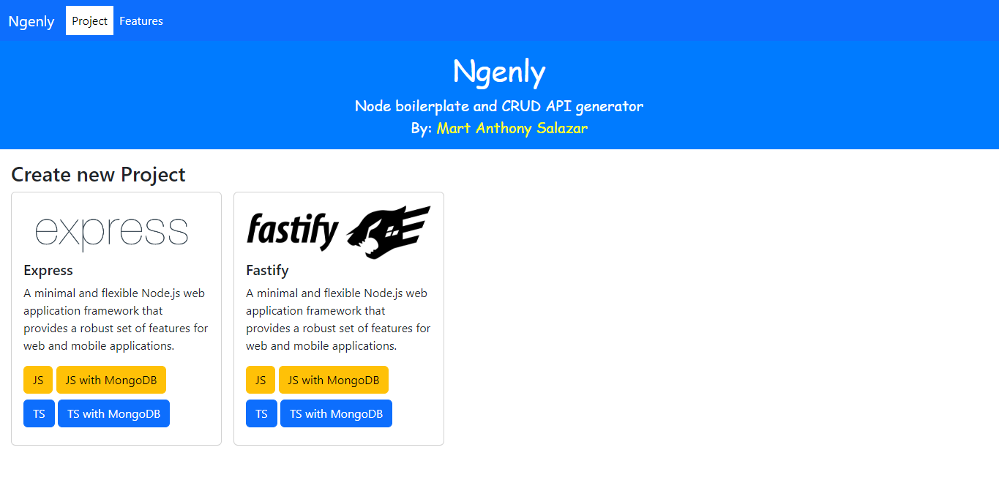

# Ngenly CLI

A node project boilerplate generator

- [Installation](#installation)
- [Commands](#commands)
- [Create New Project](#create-a-new-project)
- [Generate CRUD files](#generate-crud-files)
- [GUI](#ngenly-gui)

## Installation

Install the package globally using yarn or npm

```console
npm install -g ngenly
```

## Usage

- execute in terminal
  ngenly [command]

## Commands

| Command                             | Description                                      |
| ----------------------------------- | ------------------------------------------------ |
| `ngenly new`                        | Generates a new project                          |
| `ngenly upgrade`                    | Installs the latest version of ngenly globally   |
| `ngenly [-g / generate]`            | Starts generating project or crud using menu     |
| `ngenly -v`                         | Returns cli version                              |
| `ngenly --version`                  | Returns cli version                              |
| `ngenly -g [crud] [library] [name]` | Generates crud files (Model, Controller, Router) |
| `ngenly --gui`                      | Opens the browser for ngenly GUI                 |

## Create a new project

```console
ngenly new
```



- Project Boilerplate will be created with its own folder
  
  > You can also generate project boilerplate with one-liner command
  > Usage: ngenly -g project [expressjs | expressts | fastifyjs | fastifyts] [projectName]

```console
ngenly -g project expressjs School-Management-API
```

## Generate CRUD files

> Usage: ngenly -g crud [expressjs | expressts | fastifyjs | fastifyts] [model_name]

```
ngenly -g crud expressjs user
```



## Ngenly GUI

Ngenly GUI is a new feature introduced in version 3.0.0 of the Ngenly CLI tool. It provides a graphical user interface (GUI) for easier interaction with Ngenly and its functionalities.

As of now, the Ngenly GUI primarily includes the "Create Project" feature, allowing users to generate a new project with a few simple steps through the graphical interface. However, please note that additional features, such as creating models, routes, and controllers are planned to be added in future updates. These enhancements will further empower developers to efficiently generate and manage their projects using the Ngenly CLI tool.

Stay tuned for updates as more features are incorporated into the Ngenly GUI to enhance your development experience.

- Command for starting gui local server
> You need to be in an empty directory (your desired new project directory).
```
ngenly --gui
```
- Or you can also just enter `ngenly` command and the GUI will start


> Note: Creating a new project with Ngenly requires an internet connection as it involves cloning a boilerplate from a hosted git repository. However, generating CRUD files (Model, Route, Controller) can be done offline without the need for an internet connection.